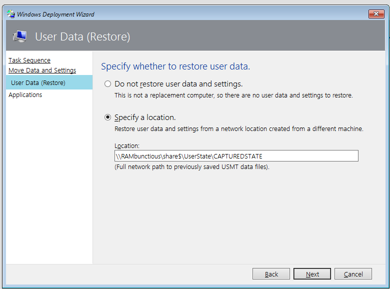

# Migrate UserState

### Steps Outlined   
```
1. Configure customsettings.ini
2. Create necessary task-sequences
3. Capture UserState
4. Deploy new Machine with previously captured userstate.
```

Advanced
```
1. Create more widely adapted MigUser.xml and other files to capture more updated and relevant things
```

# 1
CustomSettings.ini relevant settings   
``` 
;Capture UserState
UserDataLocation=NETWORK
UDShare=\\RAMbunctious\share$\UserState
UDDir=CAPTUREDSTATE
ScanStateArgs=/v:5 /o /c
LoadStateArgs=/v:5 /c /lac
SkipUserData=YES

Alternative Method: (See youtube video, this needs the UserExit.vbs script to function properly)
;Capture UserState
UserDataLocation=Network
UDShare=\\RAMbunctious\share$\UserState
UDDIR=%OSDComputername%
SkipUserData=YES
ScanStateArgs=/v:5 /o /c
LoadStateArgs=/v:5 /c /lac
``` 

# 2

In my case I will be running a TS named "WIN10-ENT-X64" which will install Windows 10, Enterprise, x64.   


TS to capture user state.   


How to Restore UserState



Resources:
https://www.youtube.com/watch?v=UEdEJ5lsEs4   
https://askme4tech.com/how-use-usmt-mdt-transfer-user-profiles   
https://ehlertech.com/customxmls   
