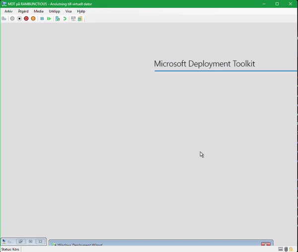

# WinPE MasterMode

I have created what I refer to as WinPE MasterMode. It is used in context with software deployments.   
Since WinPE is a very limited environment I added a bunch of tools to help with ease of acces and/or troubleshooting.   

Basically what it does is two things.   

1. Loads mdt-hotkeys.exe at the start of boot, which in turn listens for certain key-presses.    
2. When certain key-combination is pressed, it launches a secondary binary called "mdt-mastermode.exe". It also swaps the background.    

## Steps:

1. Mount your LiteTouchPE_x64.wim media.    
2. Copy mm folder and winpeshl.ini to your System32.    
3. "Copy Microsoft.PowerShell_profile.ps1" to System32\WindowsPowerShell\Microsoft.PowerShell_profile.ps1    

