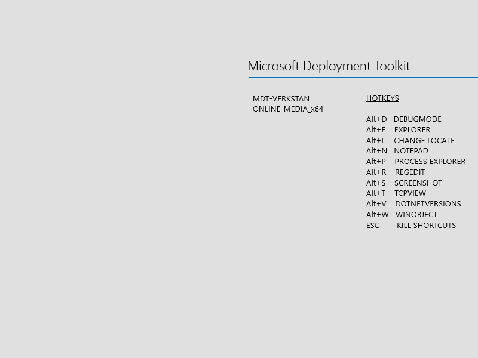
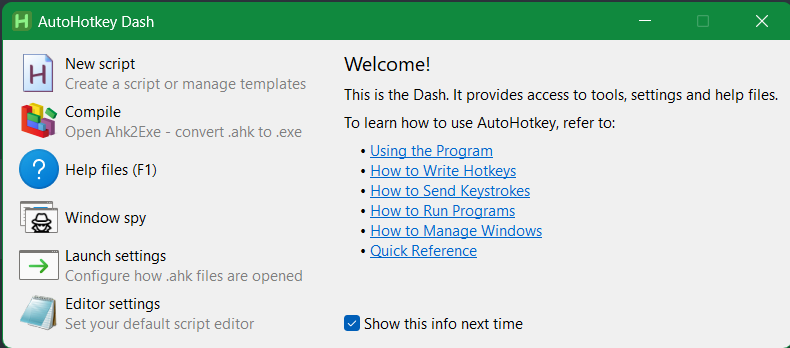
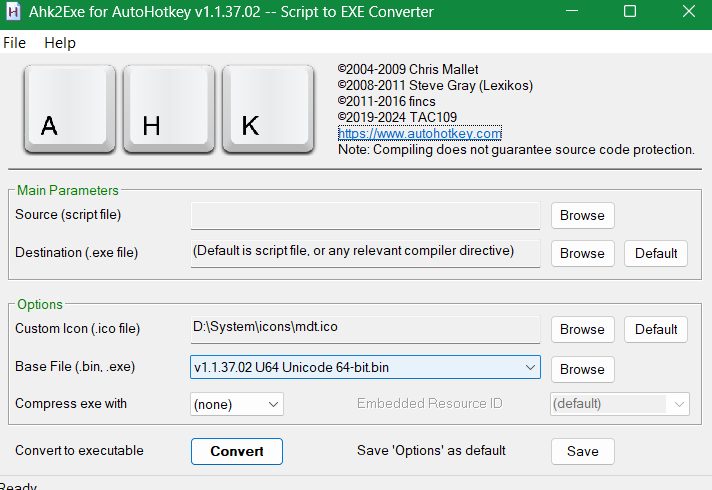
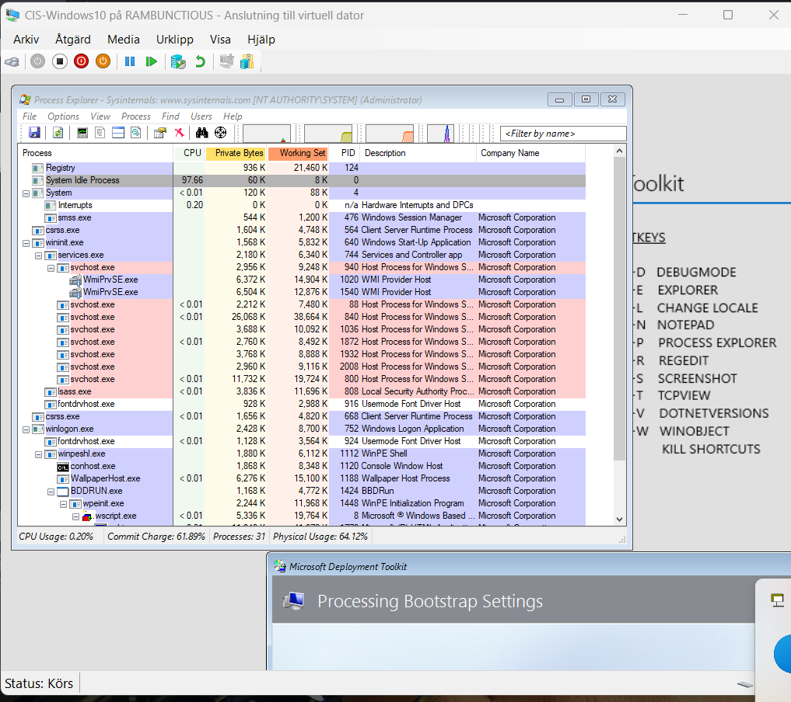

# WinPE Keyboard Shortcuts

Outline:   
1. Download AutoHotKey   
2. Create a AutoHotKey script and compile to a .exe binary   
3. Mount WinPE wim   
4. Add instructions to run compiled .exe binary at startup   
5. Profits?   

   


# 1
```
Download AutoHotKey here:   
https://www.autohotkey.com/

I downloaded both version >2 and < 2.
```
# 2
```
compile and launch a new script.

then Add for example this:

#Persistent  ; Keep the script running until explicitly exited

;MDT-verkstans tips and tricks

!d:: ; Alt+D hotkey
    Run, cmd.exe /c set TSDebugMode=TRUE, , Hide
return

!e:: ; Alt+E hotkey
    Run, "%SystemDrive%\TOOLS\PEExplorerV2.exe"
return

!v:: ; Alt+V hotkey
    Run, "%SystemDrive%\TOOLS\DotNetVer.exe"
return

!r:: ; Alt+R hotkey
    Run, "%SystemDrive%\Windows\regedit.exe"
return

!n:: ; Alt+N hotkey
    Run, "%SystemDrive%\Windows\notepad.exe"
return

!s:: ; Alt+S hotkey
    Run, "%SystemDrive%\TOOLS\screenme.exe"
return

!t:: ; Alt+T hotkey
    Run, "%SystemDrive%\TOOLS\SysInternals-WinPE\tcpview64.exe"
return

!p:: ; Alt+P hotkey
     Run, reg.exe ADD "HKCU\Software\Sysinternals\Process Explorer" /v EulaAccepted /t REG_DWORD /d 1 /f, , Hide
    Run, "%SystemDrive%\TOOLS\SysInternals-WinPE\procexp64.exe"
return

!l:: ; Alt+L hotkey
    Run, "%SystemDrive%\TOOLS\ChangeKeyboardLayout.cmd"
return

!w:: ; Alt+W hotkey
    Run, "%SystemDrive%\TOOLS\SysInternals-WinPE\Winobj64.exe"
return

Esc::ExitApp  ; Emergency Exit
return

```
   

```
Compile the script.
```


# 4
Mount your LiteTouchPE_x64.wim
```
dism /mount-wim /wimfile:LiteTouchPE_x64.wim /mountdir:.\mount /index:1

copy the compiled binary to whatever source you want.
Let's say you copy it to:

%SYSTEMROOT%\Windows\System32\hotkeybinary.exe

What you then do is edit the winpeshl.ini script to launch this bad-boy.
Add it before or after the bddrun instructions.
```

# 5
```
Use your tools :)
```
